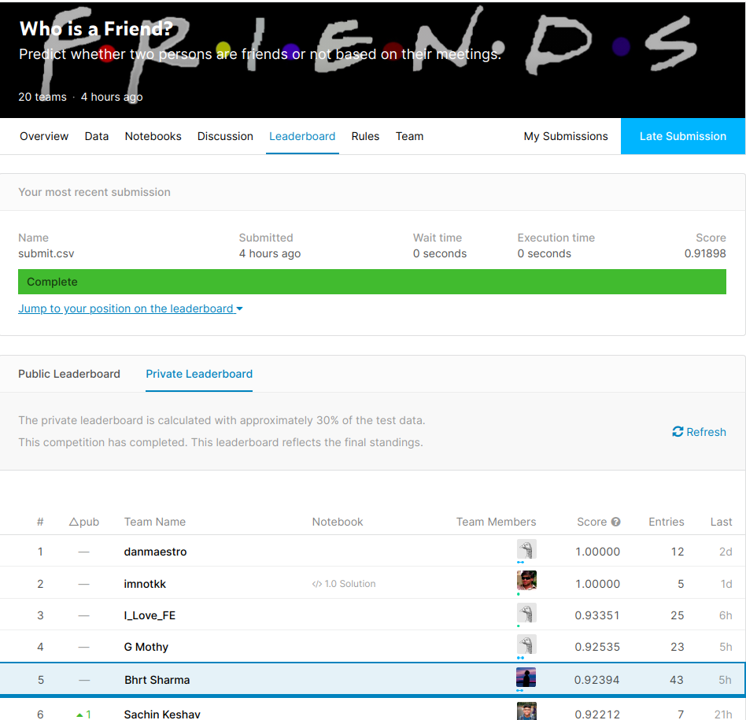

# OSS_Dev_Kaggle_Competition
Here we are supposed to find out the target variable Friend (1) or not a Friend (0) based upon the 6 independent features.

###### Did multi- layer stacking using the relevant features and got Rank 5 on both public and private leaderBoard.

PS: link of the contest's data [is this](https://www.kaggle.com/c/whoisafriend/overview)

